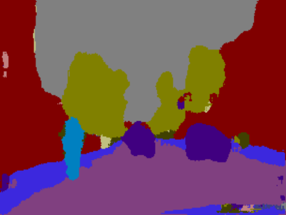
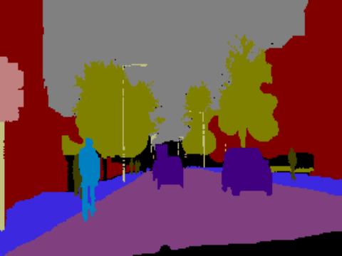
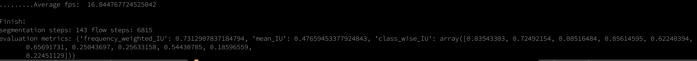
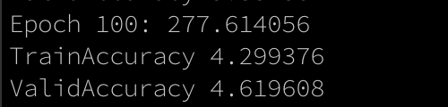

# Video-semantic-segmentatation-network

Most parts of the code is taken and modified as required from different github projects referenced [below](#references)

## Installation

This projects depends following main packages

1. tensorflow==1.14
2. tensorflow-gpu==1.14 (if gpu is available)

There are three different ways to setup the environment. **Choose one**. Ideally first and second are recommended. 
All the setups are tested on mac os.

1. poetry

Install poetry by following the [installation link][]

[installation link]: https://python-poetry.org/docs

After installation. 

	$ poetry update

This will install required dependencies by following the dependency list from [pyproject.toml](pyproject.toml)

run the following command to load the environment.

	$ poetry shell

if gpu is available on the machine then install the following

	$ pip install tensorflow-gpu==1.14

2. Conda

Install [miniconda][] by following the [conda installation link][]

[conda installation link]: https://docs.conda.io/en/latest/miniconda.html
[miniconda]: https://docs.conda.io/en/latest/miniconda.html

After conda installation, Create conda environment

	$ conda env create -f environment.yml

This will install required dependencies by following the dependency list from [environment.yml](environment.yml)

run the following command to load the environment.

	$ conda activate video-semantic-segmentation-network

if gpu is available on the machine then install the following

	$ pip install tensorflow-gpu==1.14

3. Manual Setup

This method can be used if this projects is run on google colab kind of environments where poetry and conda virtual environments are unavailable.

Python verion: 3.6

	$ pip install opencv-python==4.4.0.42
	$ pip install numpy==1.13.3
	$ pip install Pillow==7.2.0
	$ pip install pypng==0.0.20
	$ pip install matplotlib==3.3.0
	$ pip install scipy==1.5.2
	$ pip install imageio==2.9.0
	$ pip install tensorflow==1.14

if gpu is available then install the following

	$ pip install tensorflow-gpu==1.14

tensorflow==1.15 and tensorflow-gpu==1.15 can also be tried. The experiments are tested on both 1.14 and 1.15

## Jupyter setup

Jupyter needs to be installed and to list this projects settings in kernel spec do the following

	$ python -m ipykernel install --user --name=video-semantic-segmentation-network

## Download models and dataset.

#### Models and checkpoints
There are three models that are required to run the inference and all are tensorflow compatable models. The models from the best settings are uploaded on google drive and needs to be downloaded. Following are the download links

1. **resnet50_segnet_model** : [resnet50_segnet_model][] 
2. **dvs_net_flownets_checkpoints** : [dvs_net_flownets_checkpoints][]
3. **decision_network_checkpoints** : [decision_network_checkpoints][]

[resnet50_segnet_model]: https://drive.google.com/file/d/1Eh6PZLuBkV_mzvM9p7i9jBiRGGN6VOz6/view?usp=sharing
[dvs_net_flownets_checkpoints]: https://drive.google.com/file/d/10jo98ild8cU621Y8zroLZF4q0rC9K5q_/view?usp=sharing
[decision_network_checkpoints]: https://drive.google.com/file/d/1TiqORzBZpgGYKIIrA5eSpYEFXWjvP4VJ/view?usp=sharing

After downloading the compressed files, unzip them and copy them in to corresponding folders as following.

	$ unzip resnet50_segnet_model.zip -d resnet50_segnet_model_temp
	$ cp resnet50_segnet_model_temp/resnet50_segnet_model/* resnet50_segnet_model
	$ rm -rf resnet50_segnet_model_temp
	$ rm resnet50_segnet_model.zip

similarly, for dvs_net_flownets_checkpoints: This is originally from [DVSNet][] (heading: Checkpoint)

	$ unzip dvs_net_flownets_checkpoints.zip -d dvs_net_flownets_checkpoints_temp
	$ cp -r dvs_net_flownets_checkpoints_temp/dvs_net_flownets_checkpoints/* dvs_net_flownets_checkpoints
	$ rm -rf dvs_net_flownets_checkpoints_temp
	$ rm dvs_net_flownets_checkpoints.zip

[DVSNet]: https://github.com/XUSean0118/DVSNet/blob/master/README.md

and for decision_network_checkpoints,

	$ unzip decision_network_checkpoints.zip -d decision_network_checkpoints_temp
	$ cp decision_network_checkpoints_temp/decision_network_checkpoints/* decision_network_checkpoints
	$ rm -rf decision_network_checkpoints_temp
	$ rm decision_network_checkpoints.zip

#### datasets

1. Data for training the baseline segmentation network that is resnet50_segnet model. 

Download the dataset from [alexgkendell][]'s  gitbub tutorial. This dataset contains 701 annotated images (367: train, 101: val, 233: test). These images are single frame images and they are used to train segmentation network. More information is provided in the [Training](#baseline-segmentation-network-resnet50_segnet) section 

[alexgkendell]: https://github.com/alexgkendall/SegNet-Tutorial/tree/master/CamVid

2. Data for training the full network explained in two different steps in __training section__ required following dataset.

The dataset required for this is the same dataset as above but sampled at 30 frames per second. 30th frame is considered as current frame and 1st - 29th frame is considered as key frames. Annotation is provided for the current frame that is the 30th frame.

This dataset can be downloaded from here: [camvid_30_fps][]

[camvid_30_fps]: https://drive.google.com/drive/folders/1wIzlVcRHj3qe9wkn6yCeJeBrmd8KFx8L?usp=sharing

3. Data for evaluation or running the inference

If the dataset from point number 2 was downloaded then this step is not required. 
However, for running inference only and getting the **evaluation results**, this test set needs to be downloaded. This is packaged seperately for convinience and can be downloaded from here: [camvid_30_fps_test_only][]

[camvid_30_fps_test_only]: https://drive.google.com/drive/folders/1XXurb1amFvXeSLmKbpZvThhzE4mopY07?usp=sharing

4. video input

videos from camvid dataset can be downloaded from. These can be used as input to the inference. More on how to process video inputs in the following sections
1. seq01TP.avi : ftp://svr-ftp.eng.cam.ac.uk/pub/eccv/01TP_extract.avi
2. 0005VD.MXF : ftp://svr-ftp.eng.cam.ac.uk/pub/eccv/0005VD.MXF

## Running inference

#### How to get evaluation results

**Prerequisites**
1. Download pretrained models as mentioned in the [models and checkpoints section](#models-and-checkpoints) and copy them over as specified
2. Download camvid_30_fps_test_only dataset and copy it to ./camvid_30_fps_test_only/ or use the download path in the arguments

**Balanced mode** with confidence score (target) set to 80.0. If the confidence score is close to 100.0 then it is **slow mode** and its more likely that segmentation path will be chosen most of the time and a decrease in the fps is seen. Similarly, if the confidence score is set to for eg: 50.0 that is close to 0 then it is **fast mode** and its more likely that flownet path will be chosen and an increase in fps is seen.

	
	python inference_resnet_segnet.py \
	  --num_steps 6959 \
	  --target 80.0 \
	  --data_dir ./camvid_30_fps_test_only/ \
	  --save_dir ./inference-output/
	

--num_steps is number of images in testset
--data_dir is path to the download camvid test only dataset.
--save_dir is path to save the predicted images. All images are png images and start with name 'mask'

Following is one of the the predicted images  stored in the --save_dir. Corresponding ground truth image is on the right of the predicted image

Predicted Image
#  

Ground Truth Image
# 

To avoid saving predicted images set the --save_dir to none like the following.

	
	python inference_resnet_segnet.py \
	  --num_steps 200 \
	  --target 80.0 \
	  --data_dir ./camvid_30_fps_test_only/ \
	  --save_dir none
	

The output looks like the following

# 

From the output we can see that that Average fps is 16.84 on 16 GB ram machine without GPU. The segmentation steps were 143 and flowsteps were 6815.

#### How to process a video

**Prerequisites**
1. Download pretrained models as mentioned in the [models and checkpoints section](#models-and-checkpoints) and copy them over as specified
2. Download one of the sample video from the [datasets]($datasets) section point number 4 and copy it to project folder 

Run the following:

	
	python inference_resnet_segnet_video.py \
	  --target 80.0 \
	  --process_original True \
	  --video_file ./01TP_extract.avi \
	  --save_dir ./video-output/
	

The output video is stored in ./video-ouput/

	$ ls ./video-output/
	$ output-video-original.avi

This is a long video and ctrl-c in the middle of the process will still result in output video.

Following is a snapshot from the one of the following output video. A little over 2 minutes long video can be viewed on 
1. [youtube seq01TP.avi]
2. [youtube 0005VD.MXF]
3. [youtube colors seq01TP.avi] with segmentation colors
4. [youtube colors 0005VD.MXF] with segmentation colors

[youtube seq01TP.avi]: https://youtu.be/12gbAF7S1ZU
[youtube 0005VD.MXF]: https://youtu.be/ct40ZaaMS40
[youtube colors seq01TP.avi]: https://youtu.be/6Wxl6m-W5pc
[youtube colors 0005VD.MXF]: https://youtu.be/TPcPed14S9E

# 

From the output we can see that **bicyclist** is 6.68 m away from the driver view point and two **car**'s are 8.00m and 7.65m away. 

**Note:** 
1. The distance metric is enabled only for these labels ['pole', 'car', 'pedestrian', 'bicyclist']
2. If --proceess_original False then rectangles and distance information is rendered on masked video output that contains frame images that are colored with label colors.

## Training

There are 2 parts for the training. 
1. Baseline segmentation network
2. Full training of video-semantic-segmentation-network

### Baseline segmentation network: resnet50_segnet

**Prerequisites**
1. 	CamVid dataset as mentioned in [datasets](#datasets) section bullet point number 1.

Baseline model used in experiments is an encoder-decoder network with resnet50 (pretrained with imagenet) as encoder and segnet as decoder. [resnet50](model/resnet50.py) and [segnet](model/segnet.py) are the encoder and decoder network. These files are written in keras and are place holders here. They are used to load the pretrained resnet50_segnet combined model and to convert keras model from hd5 format to tensorflow protobuf pb format. [convert_keras_to_tensorflow_pb.py](convert_keras_to_tensorflow_pb.py)

Ideally training is performed on machines with GPU support and [resnet50_segnet_training][] a jupyter notebook can be used to train a new model. This notebook is used to generate a baseline model in our experiments and is run on google colab with GPU support.

[resnet50_segnet_training]:https://colab.research.google.com/drive/1Rpkg_cBLc0VdIGvUZdWo3FsMHgXlVPdH?usp=sharing

#### what to do with the baseline segmentation network model.

After training a new model with the above jupyter notebook on google colab, the trained model is a keras supported model saved typically 'resnet50_segnet.h5'. This model file is in hd5 format and needs to be converted to protobuf format 'resnet50_segnet.pb'
Do the following

	$ cp resnet50_segnet.h5 ./resnet50_segnet_model/resnet50_segnet.h5
	$ python convert_keras_to_tensorflow_pb.py

This should convert the keras model into protobuf format and the converted file should be copied to ./resnet50_segnet_model/resnet50_segnet.pb

	$ ls -rtl ./resnet50_segnet_model/

###  Full Training of video semantic segmentation network

**Prerequisites**

1. camvid_30_fps dataset as mentioned in [datasets](#datasets) section bullet point number 2.
2. Newly trained baseline segmentation network model copied to respective folder as [mentioned above](#what-to-do-with-the-baseline-segmentation-network-model)
3. Download the pretained dvs_net_flownets_checkpoints and copy to respective folder as mentioned in [models and checkpoints](#models-and-checkpoints) point number 2

#### Generate features

This step will generate features that are then used as training data to train a regression model in the next step.

Training set: 

	
	python generate_resnet_features.py \
	  --data_dir ./camvid_30_fps/ \
	  --data_list list/train_file_list.txt \
	  --num_steps 11005 \
	  --save_dir ./generated_features_resnet_segnet/train/
	

Validation set:
	
	
	python generate_resnet_features.py \
	  --data_dir ./camvid_30_fps/ \
	  --data_list list/val_file_list.txt \
	  --num_steps 229 \
	  --save_dir ./generated_features_resnet_segnet/val/
	

After running the above steps X.npy and Y.npy files should have been created under ./generated_features_resnet_segnet/train and ./generated_features_resnet_segnet/val folders.

#### Training decision network

This is a regression model that uses the features (X.npy and Y.npy) from the previous steps. 

Run:

	
	python train_decision_network.py \
	  --train_data_dir ./generated_features_resnet_segnet/train/ \
	  --val_data_dir ./generated_features_resnet_segnet/val/ \
	  --save_dir ./decision_network_checkpoints/

This should store checkpoints in specified directory and the output will print the training and validation rms error like the following after 100 epochs

# 

After generating features and training a new decision network in addition to creating a new baseline model. Steps in the inference can be run to see the prediction of new model

# References

1. CamVid dataset: [alexgkendell][]
2. Baseline model training: [image-segmentation-keras][]
3. Flownets model checkpoints: [DVSNet][]

[alexgkendell]: https://github.com/alexgkendall/SegNet-Tutorial/tree/master/CamVid
[image-segmentation-keras]: https://github.com/divamgupta/image-segmentation-keras
[DVSNet]: https://github.com/XUSean0118/DVSNet

